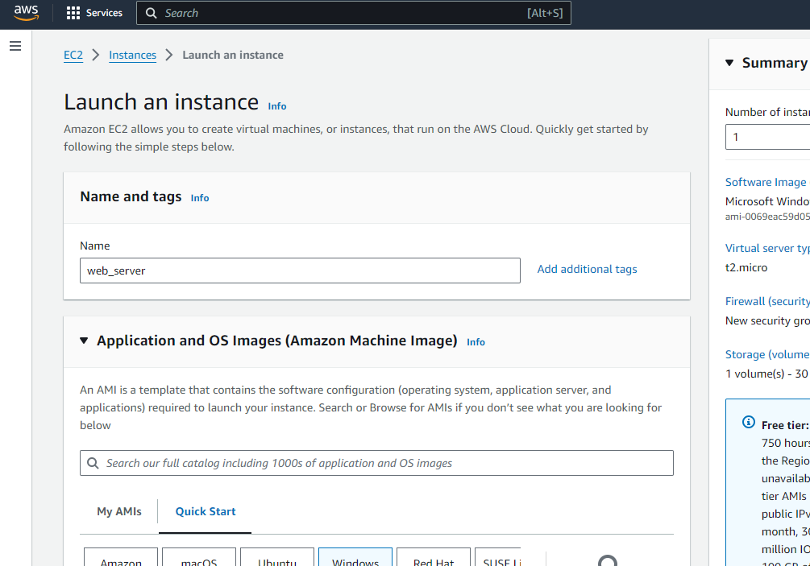
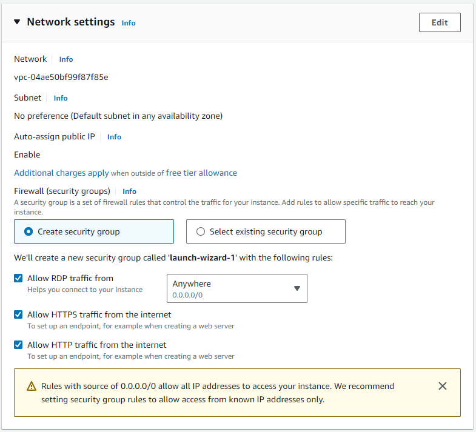
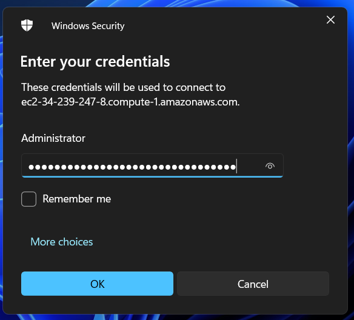
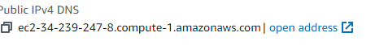
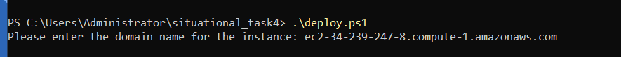
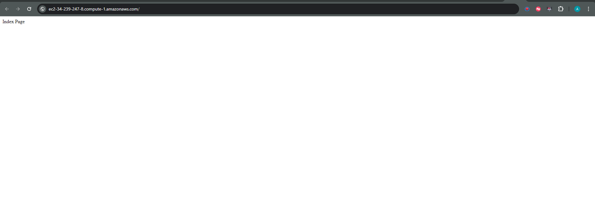
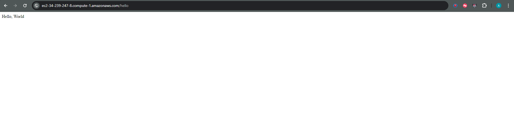

# Task 1: Automating application deployment

**Customer company:** E-commerce company "TechMart"

**Additional requirements:**

- Deploying a web application on a server using a Docker container.
  
**Instructions:**

1. Clone this repository.
   ```bash
   git clone https://github.com/your-username/your-repository.git
   ```

2. Navigate to the project directory.
   ```bash
   cd my_django_app
   ```

3. Set up your domain name.
   ```bash
   Please enter the domain name for the instance: yourdomain.com
   ```

4. Run the deployment script.
   ```bash
   .\deploy.ps1
   ```

**Restrictions:**

- The deployment assumes Docker and Docker Compose are installed on the server.
- Ensure the domain name provided is correctly configured to point to the server's IP address.

**Answers to possible questions:**

- **Q:** How do I access the deployed application?
  - **A:** Once the deployment script has run successfully, you can access the application by navigating to http://yourdomain.com in your web browser.

- **Q:** How can I modify the Docker configuration?
  - **A:** You can modify the Dockerfile, docker-compose.yml, and nginx.conf files in the project directory to adjust the Docker configuration according to your needs.

- **Q:** What if I encounter issues during deployment?
  - **A:** If you encounter any issues during deployment, please check the logs for any error messages and ensure that Docker and Docker Compose are installed correctly on your server. Feel free to reach out to the project maintainer for assistance.

**Screenshots.**

## Launchin AWS EC2 instance with Windows Operating system.


Opening firewall rules



Connecting to the instance using RDP.



Lets provide intace domain name




Let's check the result


